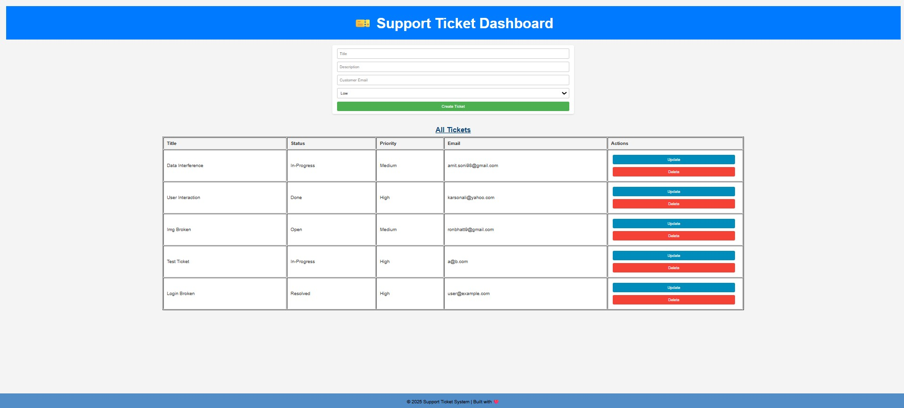
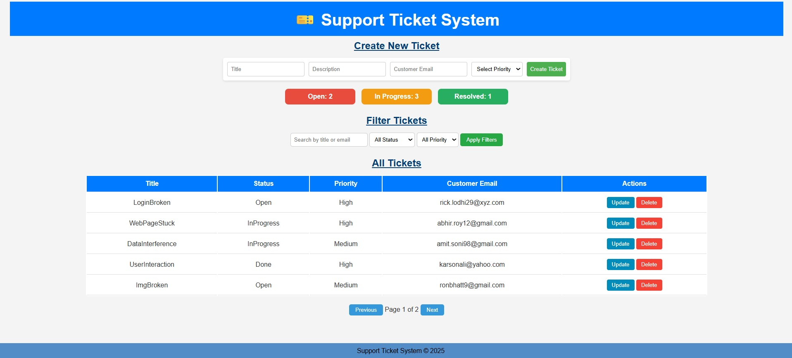

# 🎫 Support Ticket Management System

A full-stack **Support Ticket Management System** built with **Node.js (Express)**, **MongoDB (Mongoose)**, and a **vanilla JavaScript frontend**.  
It allows you to **create, update, delete, and filter tickets** with **pagination, status tracking, and statistics**.

---

## 🚀 Features

✅ **Create / Read / Update / Delete (CRUD)** for support tickets  
✅ **Search & Filter** by title, email, status, and priority  
✅ **Pagination** for large ticket lists  
✅ **Ticket Statistics** (Open, In Progress, Resolved)  
✅ **Responsive UI** with colored status & priority badges  
✅ **Webhook support** for status change events  
✅ **Backend API** for integration with other tools  

---

## 🛠️ Tech Stack

**Frontend**
- HTML5, CSS3, JavaScript (Vanilla)
- Fetch API for data requests
- Responsive, mobile-friendly UI

**Backend**
- Node.js with Express.js
- MongoDB with Mongoose ORM
- REST API endpoints
- Webhook event trigger on status change

---

## Deployed on Render
<a href="https://support-ticket-api-1.onrender.com">🎫 Support Ticket System</a>
<h3>Previous Version</h3>

<h3>Latest Changes</h3>

